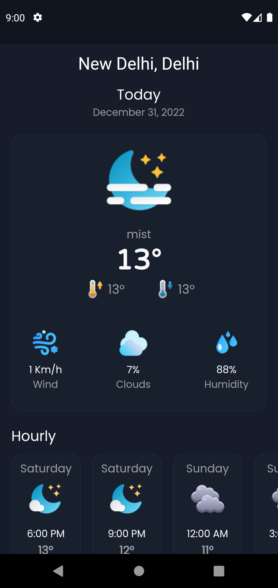

# weather_app

A weather App Made using Flutter using Openweathermap Api and Geolocator.

## Getting Started
Add your own Openweather Api Key in: 
>lib -> provider -> api -> fetch_weather.dart

>> static const String apiKey = "YOUR OPENWEATHER API Key";

You can get your own Api Key From [Openweathermap](https://openweathermap.org/)

[Download Demo Apk](https://drive.google.com/file/d/1FknnqoRvbvUUIU2apKZHCRSk9TqqyJuE/view?usp=sharing)
### App Screenshots

